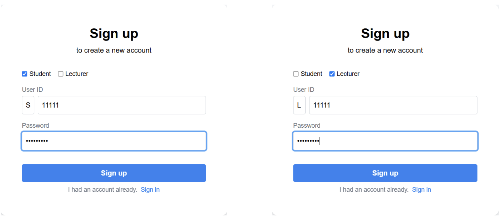
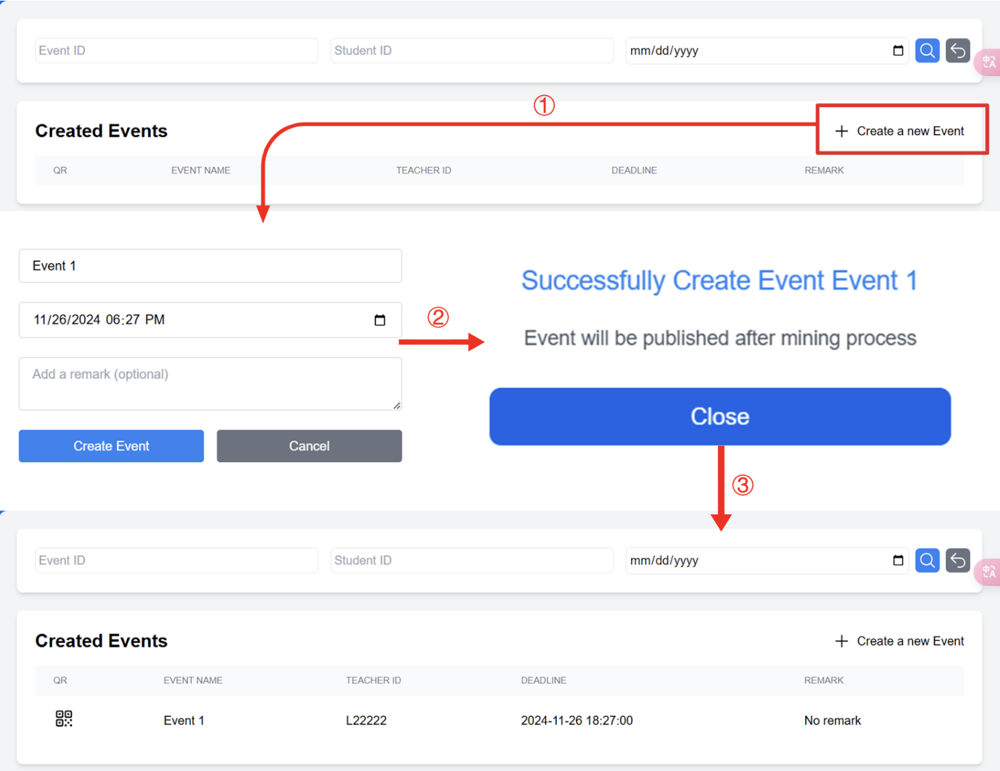
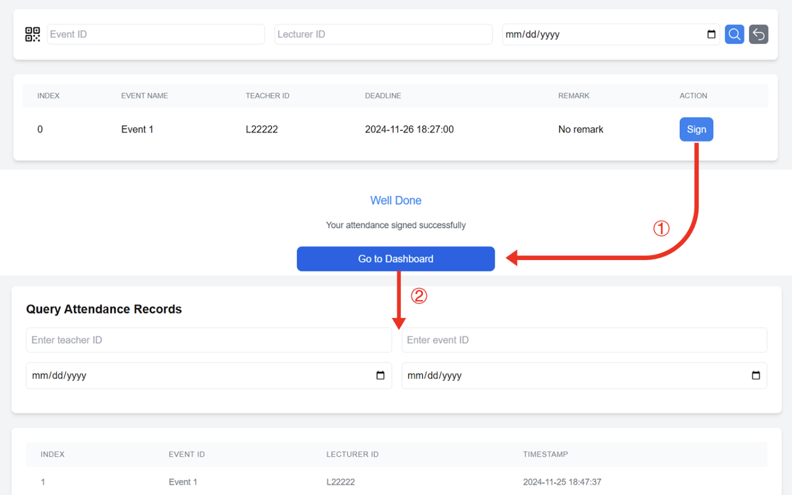
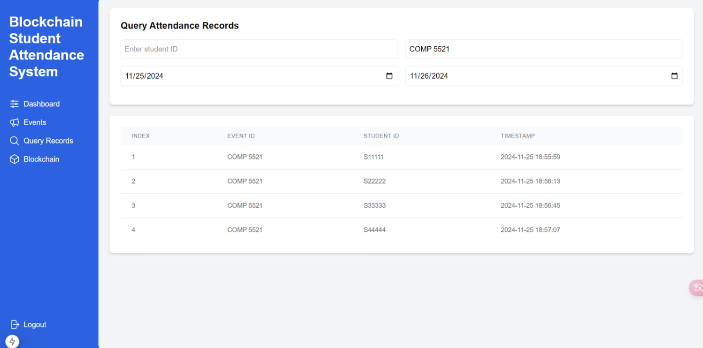
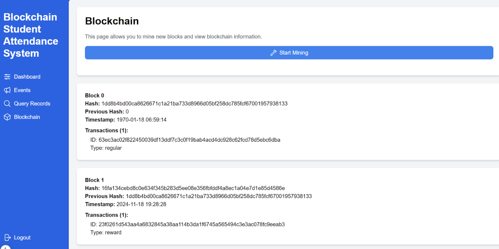

# StuChain: A Student Attendance Application Based on NaiveCoin

**MA Zhiyuan, WANG Zepeng, QIN Cailing, XU Junda, DU Jiahao**  

**November 30, 2024**

---

# Introduction

## Project Background
Blockchain has evolved significantly, transitioning from cryptocurrency into numerous real-world applications, including education. Traditional student attendance systems face challenges like inefficiency, potential for data tampering, and poor transparency. This project leverages blockchain, specifically NaiveCoin, to develop a decentralized attendance system with transparent, tamper-proof records.

## Problem Statement
Major problems in current systems:
- Reliance on manual processes prone to errors.
- Susceptibility of centralized systems to tampering, reducing credibility.
- Difficulty in verifying and resolving disputed records.

Limitations of NaiveCoin:
- Lacks user registration and dynamic adjustment mechanisms.
- Lacks resolution strategies for conflicts in multi-node environments.
- Minimalistic on-chain features and unfriendly user interface.

## Objectives
The goal is designing and implementing a secure, blockchain-powered attendance system:
1. Easy-to-use interfaces for attendance recording and querying.
2. Dynamic adjustment of mining difficulty based on system load.
3. Tamper-proof, encrypted attendance data stored on the blockchain.
4. Scalable and decentralized operation using NaiveCoin as the foundation.

---

# Literature Review

## NaiveCoin
NaiveCoin is a lightweight blockchain framework intended for educational purposes, retaining key blockchain features:

- Block structure.
- Proof-of-Work (PoW).
- P2P network communication.
- HTTP API interfaces.

## Blockchain for Education
Prominent use cases include:
- MIT’s blockchain-led Digital Diploma project for secure academic certificates.
- The European Commission’s EBSI initiative for seamless credential recognition across Europe.

## Blockchain Characteristics
Key benefits utilized in the attendance system:
- **Immutable**: Records cannot be erased.
- **Secure**: Cryptography ensures the reliability of stored data.
- **Transparent**: Decentralized validation ensures trustworthiness.

---

# Methodology

## RAD Model Workflow
This project used the Rapid Application Development (RAD) model for rapid—but structured—prototyping and iteration.

### System Framework
The architecture is composed of three layers:
1. **Presentation Layer**: User-side operations.
2. **Application Layer**: Processes attendance data.
3. **Data Layer**: Stores secure, tamper-proof blockchain data.

---

# Development Environment

## Framework
- **Next.js**: Next.js is a powerful React framework that lets developers build high-performance web apps with
server-side rendering, static site generation, and automatic code splitting. It provides an enhanced
development experience with features like built-in CSS support, TypeScript integration, and automatic
optimization, making it ideal for creating scalable and SEO-friendly websites. Next.js simplifies complex
web development tasks by offering a simple setup, efficient routing, and seamless deployment options.
- **NaiveCoin**
NaiveCoin is a lightweight blockchain implementation designed for educational and experimental
purposes. It has a simple codebase and clear structure, making it suitable for secondary development. This
project uses NaiveCoin as the backend framework, enhanced with additional functionalities to meet the
requirements of the student attendance system.

## Tools
### Github
GitHub is a Git-based distributed version control platform that provides powerful support for code
management and team collaboration for project development: Each code commit, modification and update
is recorded, making it easy to track development history and roll back versions when needed; Through the
branching mechanism, multiple developers can develop different functional modules in parallel to avoid
code conflicts. Developers can submit code changes via Pull Request, and other team members can review
the code to ensure code quality and consistency. Teams can record and assign issues in the development
process and track their progress at any time.
### Trello
Trello is a visual task management tool for tracking project progress and assigning tasks:
Development teams can assign specific tasks to each member and mark their priorities and deadlines. Drag-
and-drop cards to move between “To-Do”, “In-Progress” and “Completed” statuses to reflect task status in
real-time. Team members can comment, upload attachments, or add notes to the task cards, ensuring that
the communication and execution of each task are documented. Tasks in each development cycle can be
managed through Kanban, ensuring clear and controllable goals for each iteration.
### Visual Studio Code
VSCode is a lightweight yet powerful code editor developed by Microsoft, widely regarded as one
of the best tools for modern software development. Its flexibility, speed, and rich extension ecosystem make
it an indispensable tool for developers.

---

# Implementation
## The Process of User Registration (Student and Lecturer)

## The Process of User Login (Student and Lecturer)

## Teacher Posting Attendance Function Implementation

## Student Attendance Function Implementation

## Attendance Enquiry Function Implementation (Lecturer)

## User participation in blockchain mining process implementation

## Discussion
During the development of this project, our team held multiple discussions regarding the design
of the blockchain-based attendance system, focusing on key issues such as system feasibility, efficiency
and user experience. Throughout these discussions, we proposed two main design hypotheses and,
through comparison and analysis of these two approaches, ultimately determined the system's
implementation plan.

---

# References

1. Gomes, "Naivecoin: A Tutorial for Developers," GitHub, 2017. [Repository Link](https://github.com/conradoqg/naivecoin)  
2. J. Dunn (2017). "MIT’s Blockchain Diplomas." _MIT News._  
3. European Commission (2023). "Blockchain for Cross-Nation Credentialing."  
4. Arnab et al., "Machine Learning and Blockchain-Based Attendance Systems," 2021.  
5. Webisoft, "Blockchain in Education: Next Steps." 2024.  
